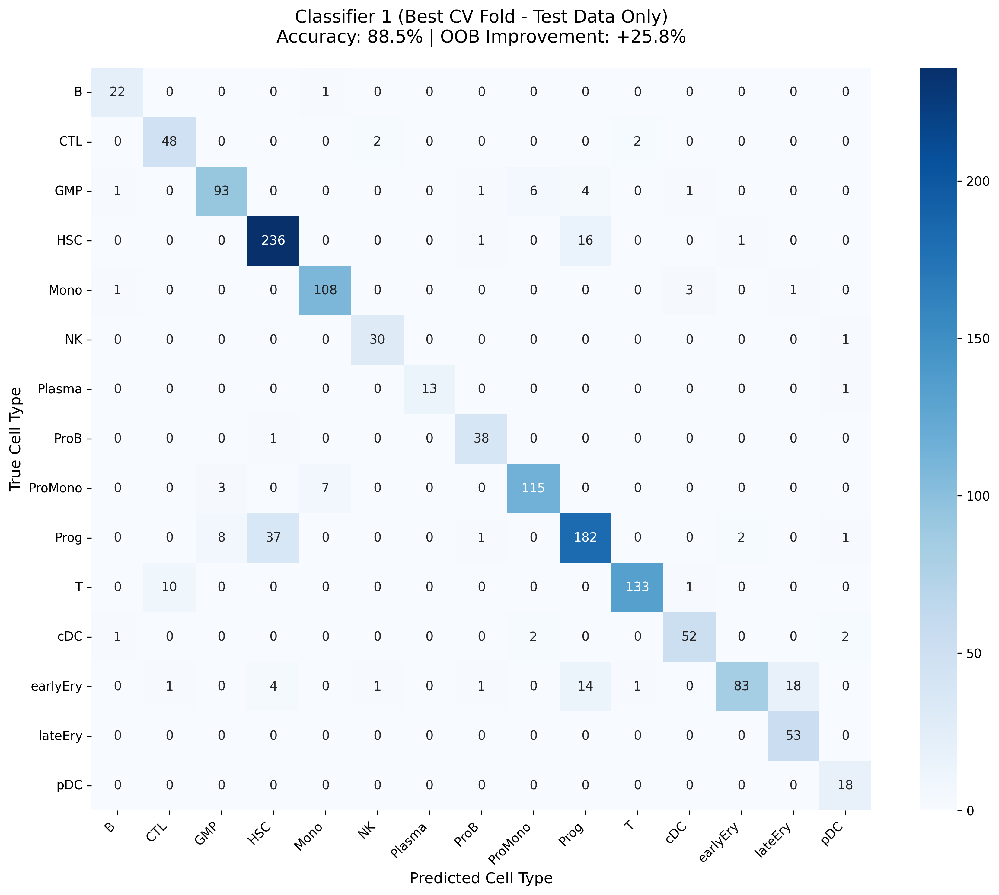
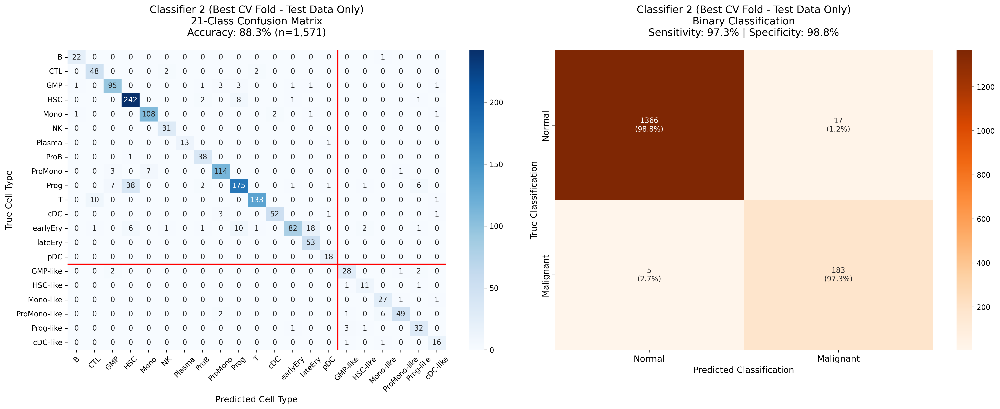
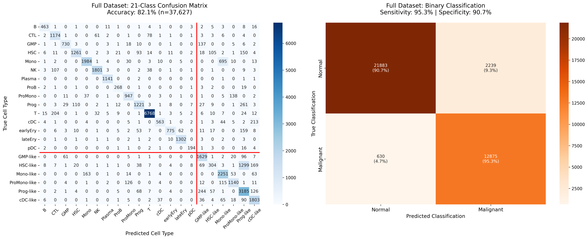

# Reimplementation of van Galen Random Forest Classifier

Reimplementation of van Galen et al.'s two-stage Random Forest classifier for distinguishing malignant from normal cells in AML bone marrow samples.

## Overview

This pipeline implements a hierarchical classification approach:
1. **Classifier 1**: Assigns cells to one of 15 normal cell types
2. **Classifier 2**: Distinguishes normal cells from malignant-like cells (21 classes: 15 normal + 6 malignant-like)

---

## Step 1: Data Preparation

Preprocess van Galen AML dataset:
- Filter to normal cells (15 cell types) for Classifier 1 training
- Normalize to Cp10k + log-transform
- Filter genes by mean expression > 0.01

---

## Step 2: Classifier 1 - Cell Type Classification

Train Random Forest to classify 15 normal cell types with two-stage feature selection:
- Outer RF (1000 trees) on all genes
- Inner RF (1500 trees) on top 1000 genes by importance


*Classifier 1 confusion matrix. 5-fold cross-validation performance on 15 normal cell types.*

---

## Step 3: Prepare Malignant Training Data

Apply Classifier 1 to malignant cells to create 21-class dataset:
- 15 normal cell types (from healthy cells)
- 6 malignant-like types (e.g., "HSC-like", "Prog-like")

---

## Step 4: Classifier 2 - Malignancy Classification

Train 21-class classifier to distinguish normal from malignant-like cells:


*Classifier 2 cross-validation performance on 21-class training data.*

---

## Evaluation: Direct vs Hierarchical Approach

Two inference strategies evaluated on the full dataset:

### Direct Approach
Apply Classifier 2 directly to all cells:


*Direct application of Classifier 2 to full dataset.*

### Hierarchical Approach (van Galen method)
Classifier 1 assigns cell type, then Classifier 2 predicts malignancy:


*Two-stage hierarchical classification (Classifier 1 then Classifier 2) on full dataset.*

---

## Files

| File | Description |
|------|-------------|
| `run_pipeline.py` | Orchestrates all pipeline steps |
| `step1_prepare_data.py` | Data preprocessing and normalization |
| `step2_classifier1.py` | Train 15-class cell type classifier |
| `step3_prepare_malignant.py` | Create 21-class training data |
| `step4_classifier2.py` | Train malignancy classifier and evaluate |
| `balanced_rf.py` | Balanced Random Forest implementation |

---

## Usage

```bash
# Run complete pipeline
python run_pipeline.py

# Run specific step (1-4)
python run_pipeline.py 2
```

### Output

Predictions saved to `results/van_galen_classifier_results.csv`:
- `clf1_pred`: Classifier 1 cell type prediction
- `clf2_direct_pred`: Direct Classifier 2 prediction
- `clf2_hierarchical_pred`: Hierarchical pipeline prediction
- `*_binary`: Aggregated normal/malignant labels