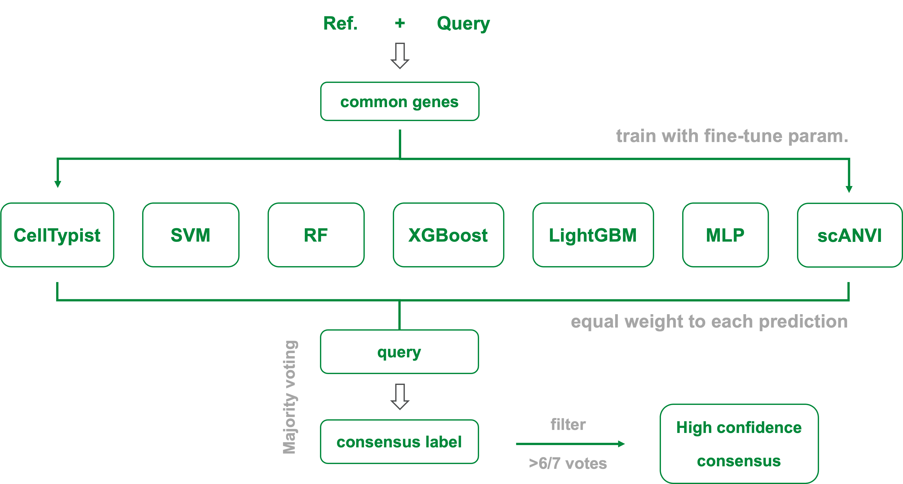
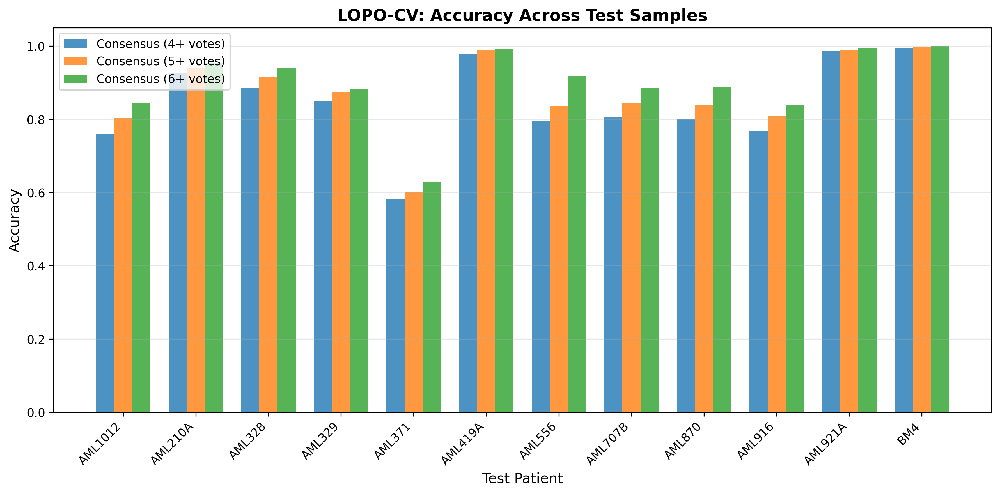

# Consensus Ensemble Classifier for HSPC/LSPC Classification

Seven-model ensemble for binary classification of hematopoietic stem/progenitor cells (HSPC) versus leukemic stem/progenitor cells (LSPC) from single-cell RNA-seq data.

## Overview

This pipeline trains seven individual classifiers on a Van Galen reference dataset and combines their predictions via consensus voting to improve classification robustness and accuracy.

---

## Workflow

### Step 1: Individual Predictor Training

Seven binary classifiers are trained and fine-tuned on the reference dataset:

| Model | Type | Key Parameters |
|-------|------|----------------|
| CellTypist | Logistic Regression | C=0.6, balanced classes |
| Random Forest | Two-stage ensemble | 300 trees, depth=20, 1500 selected genes |
| SVM | RBF kernel | C=0.5, gamma=scale |
| XGBoost | Gradient boosting | 100 trees, depth=6, lr=0.2 |
| LightGBM | Gradient boosting | 200 trees, depth=6, lr=0.2 |
| MLP | Neural network | 512-256-128 hidden layers |
| scANVI | Variational autoencoder | Transfer learning |

Training and hyperparameter tuning scripts are located in `individual_predictor/`.

---

### Step 2: Ensemble Integration

Individual predictions are aggregated via consensus voting with configurable thresholds.



*Figure. Consensus ensemble workflow. Seven independently trained classifiers vote on each cell. Predictions are generated at three consensus thresholds: simple majority (>=4 votes), Consensus_5 (>=5 votes), and Consensus_6 (>=6 votes). Higher thresholds improve precision at the cost of cell coverage.*

---

### Step 3: Performance Evaluation

**Table 1. Ensemble classifier performance on Van Galen held-out patients**

| Dataset | Cells | HSPC | LSPC | Patients | Genes |
|---------|-------|------|------|----------|-------|
| Train (ref.) | 7,003 | 2,273 | 4,730 | 6 (5 AML + 1 healthy) | 3,000 HVGs |
| Test (query) | 1,550 | 640 | 910 | 6 (5 AML + 1 healthy) | 3,000 HVGs |

| Model | Accuracy | H. Recall | H. Prec. | L. Recall | L. Prec. | F1 Score |
|-------|----------|-----------|----------|-----------|----------|----------|
| Best Individual (SVM) | 85.6% | 75.2% | 88.3% | 93.0% | 84.2% | 0.848 |
| Consensus | 86.1% | 80.9% | 84.8% | 89.8% | 87.0% | 0.856 |
| Consensus (5+ votes) | 87.5% | 82.2% | 86.7% | 91.2% | 88.0% | 0.849 |
| **Consensus (6+ votes)** | **90.2%** | **85.0%** | **90.6%** | **93.8%** | **90.0%** | **0.898** |

*Patient-level split ensured no data leakage. Higher voting thresholds improved accuracy at the cost of reduced cell coverage. H. = HSPC (normal); L. = LSPC (malignant); Prec. = precision; HVGs = highly variable genes.*

---

### Step 4: Cross-Validation



*Figure. Leave-one-patient-out cross-validation (LOPO-CV) accuracy for the consensus ensemble models across 12 test patients and one healthy donor.*

---

## Files

| File | Description |
|------|-------------|
| `individual_predictor/` | Training scripts for each classifier |
| `individual_predictor/finetune_hyperparameters.py` | Hyperparameter optimization |
| `utility/` | Helper functions and data utilities |
| `run_ensemble.py` | Main inference pipeline |
| `ensemble_analysis_binary.py` | Evaluation and visualization |
| `*_predictor.py` | Individual model wrapper classes |

---

## Usage

### Inference on New Data

```python
from run_ensemble import run_ensemble

# infer: unlabeled query | eval: labeled query (generates metrics)
run_ensemble(
    ref_path='path/to/vangalen_reference.h5ad',
    query_path='path/to/query.h5ad',
    output_dir='output/',
    status='infer'  # or 'eval' for labeled data
)
```

### Output

Results are saved as `ensemble_results.h5ad` with predictions at three levels:
- `consensus`: Majority vote
- `consensus_5votes`: High confidence (>=5/7 models agree)
- `consensus_6votes`: Very high confidence (>=6/7 models agree)

Cells not meeting the threshold are labeled as "Unassigned".

### Evaluation Mode

When `status='eval'` with labeled query data:

```python
from ensemble_analysis_binary import BinaryEnsembleAnalyzer

analyzer = BinaryEnsembleAnalyzer('output/ensemble_results.h5ad')
results = analyzer.generate_binary_report(output_dir='output/')
```

Generates accuracy metrics, confusion matrices, and per-patient performance summaries.
