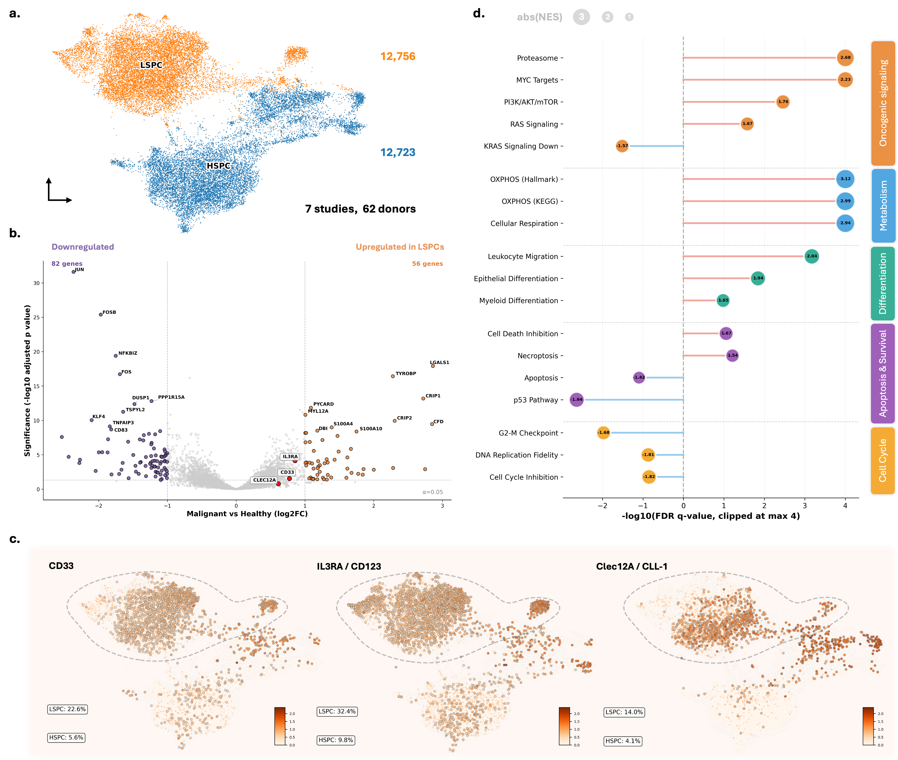
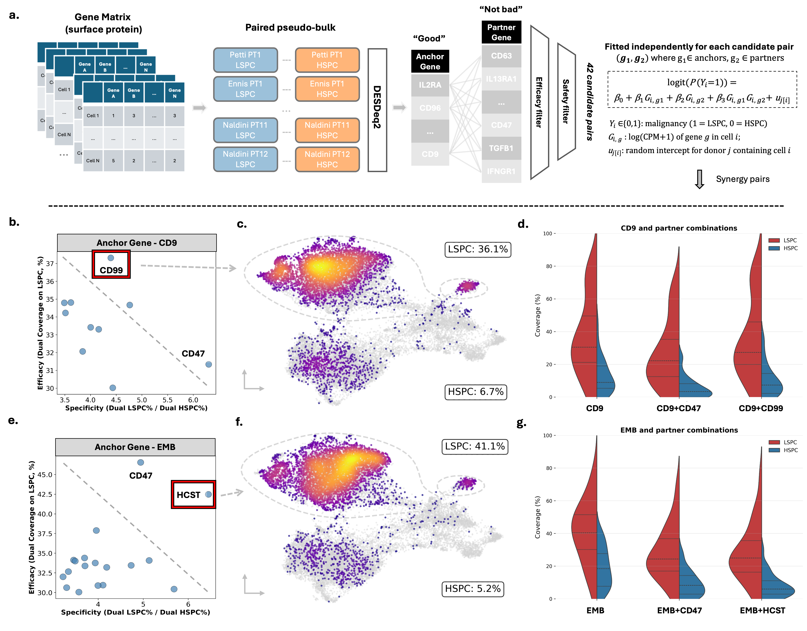

# Dual-Target Discovery for AND-Gate CAR-T Therapy in AML

Computational pipeline for identifying synergistic surface antigen pairs that selectively target leukemic stem/progenitor cells (LSPCs) while sparing healthy HSPCs.

## Overview

This analysis leverages an integrated single-cell RNA-seq dataset of 25,479 primitive HSC/MPP cells (12,756 HSPC, 12,723 LSPC) from 62 donors across 7 studies to:

1. **Characterize LSPC transcriptional programs** via differential expression and pathway enrichment
2. **Identify dual-target combinations** for AND-gate CAR-T therapy with optimized efficacy-specificity trade-offs

---

## Workflow

### Step 1: Conventional Single-Cell Analysis

Standard characterization of the LSPC compartment:
- **UMAP visualization** with scVI/scANVI batch correction
- **Pseudo-bulk DEG analysis** using DESeq2 (study as covariate)
- **GSEA** across Hallmark, GO-BP, and KEGG databases
- **Feature plots** for established immunotherapy targets (CD33, IL3RA, CLEC12A)


*Figure 4. Differential gene expression reveals oncogenic programs and therapeutic targets enriched in primitive LSPCs. (a) UMAP projection of 25,479 primitive HSC/MPP cells (12,756 HSPC, 12,723 LSPC) from 62 donors across 7 datasets following batch correction and integration. Cells expressing fewer than 100 genes were excluded. (b) Volcano plot of pseudo-bulk differential expression between LSPC and HSPC using DESeq2 (study as covariate). Significance threshold: padj<0.05, |log2FC|>1 (82 downregulated, 56 upregulated). Established immunotherapy targets (CD33, IL3RA, CLEC12A) highlighted in red. (c) Expression of therapeutic target candidates CD33, IL3RA/CD123, and CLEC12A/CLL-1 across the integrated landscape, demonstrating enrichment in the LSPC population. Percentages indicate proportion of cells with detectable expression in each population. (d) Gene set enrichment analysis across five functional categories (Oncogenic Signaling, Metabolism, Differentiation, Apoptosis & Survival, Cell Cycle) comparing LSPC vs HSPC. Dot size represents absolute normalized enrichment score (|NES|); bar length and direction indicate -log10(FDR q-value) with positive values (orange) representing LSPC enrichment and negative values (purple) representing HSPC enrichment.*

---

### Step 2: Dual-Target Discovery Pipeline

Systematic identification of synergistic AND-gate pairs:

1. **Surface protein filtering**: Genes mapped to curated surface proteome (CSPA + CellphoneDB + ML-ETH Surfaceome)
2. **Anchor selection**: Significantly upregulated (log2FC > 0.6, padj < 0.05)
3. **Partner screening**: Positive fold-change (log2FC > 0)
4. **Coverage filtering**: Dual LSPC coverage >= 30%, dual HSPC coverage <= 10%
5. **Synergy modeling**: Logistic regression with interaction term; positive beta3 indicates synergy


*Figure 5. Dual-target discovery pipeline identifies synergistic AND-gate CAR-T pairs. (a) Differentially expressed surface proteins (pyDESeq2) were classified as anchors (log2FC > 0.6, adjusted p < 0.05) or partners (log2FC > 0). Gene pairs were filtered by efficacy (>=30% dual LSPC coverage) and safety (<=10% dual HSPC coverage), then modeled using logistic regression to identify synergistic pairs (positive interaction coefficient beta3). (b, e) Efficacy-specificity trade-off for pairs using CD9 (b) or EMB (e) as anchor. Boxed pairs represent favorable combinations. Dashed lines indicate Pareto frontiers. (c, f) UMAP visualization of dual-positive cells for CD9+CD99 (c) and EMB+HCST (f). Color intensity reflects co-expression density; dashed circles demarcate the LSPC compartment. Percentages indicate dual coverage. (d, g) Per-donor coverage distributions for anchors alone versus combinations. Split violins show LSPC (red) and HSPC (blue) coverage. Dual targeting reduces LSPC coverage but markedly diminishes HSPC off-target exposure across donors.*

---

## Key Results

Four synergistic pairs identified for AND-gate CAR-T:

| Pair | LSPC Coverage | HSPC Coverage | Specificity Gain |
|------|---------------|---------------|------------------|
| CD9 + CD99 | High | Low | +++ |
| CD9 + CD47 | High | Low | ++ |
| EMB + CD47 | Moderate | Very Low | +++ |
| EMB + HCST | Moderate | Very Low | +++ |

---

## Files

| File | Description |
|------|-------------|
| `MasterList_surface_protein_gene.xlsx` | Curated surface proteome (CSPA + CellphoneDB + ML-ETH) |
| `DEG_DESeq2.py` | Pseudo-bulk differential expression with DESeq2 |
| `run_gsea.py` | Gene set enrichment analysis (Hallmark, GO-BP, KEGG) |
| `umap_featureplot.py` | scVI/scANVI integration and visualization |
| `pair_search_statistical_interaction.py` | Dual-target discovery with interaction modeling |

---

## Usage

```bash
# 1. Generate UMAP and feature plots
python umap_featureplot.py

# 2. Run differential expression
python DEG_DESeq2.py

# 3. Perform GSEA
python run_gsea.py

# 4. Identify dual-target pairs
python pair_search_statistical_interaction.py
```